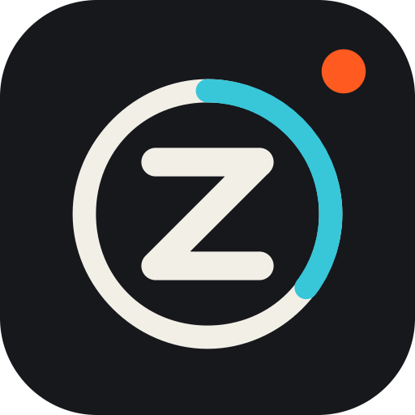
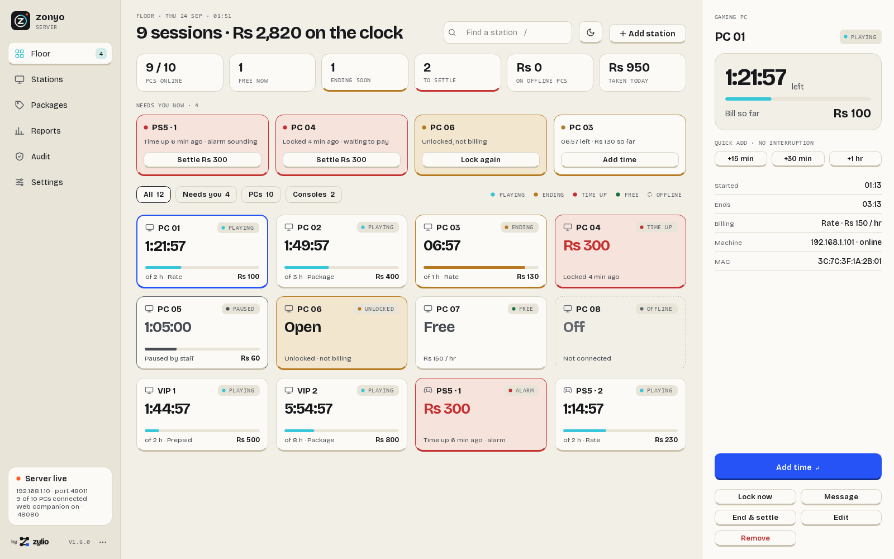
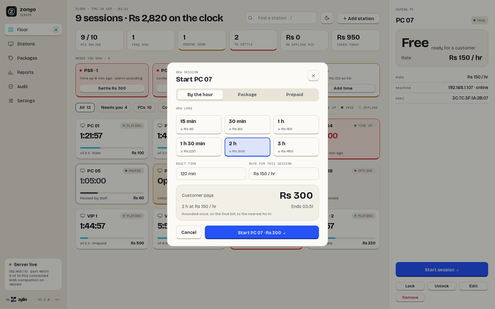
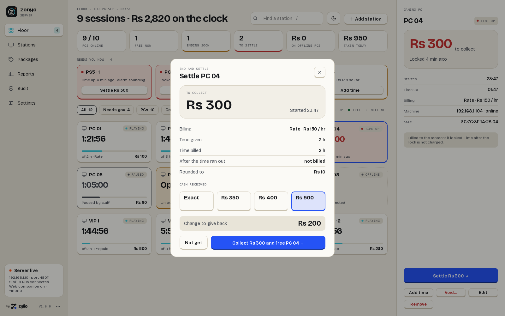
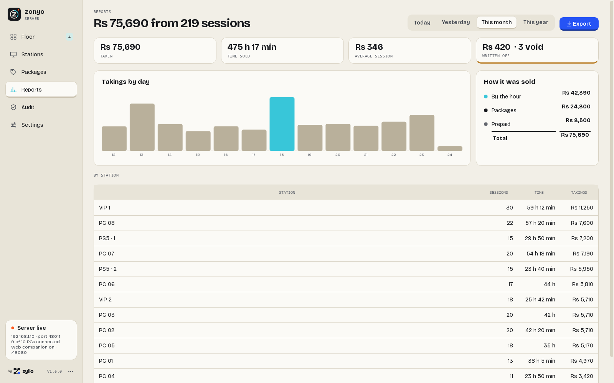
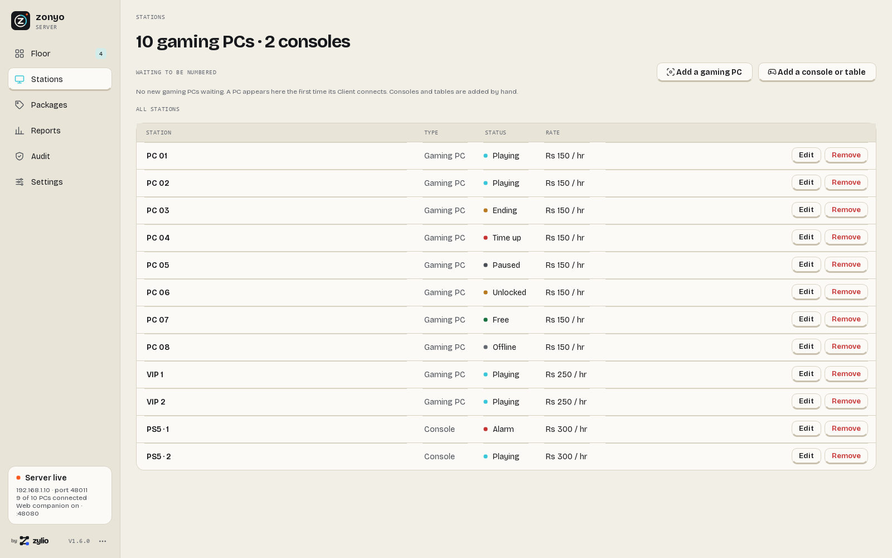
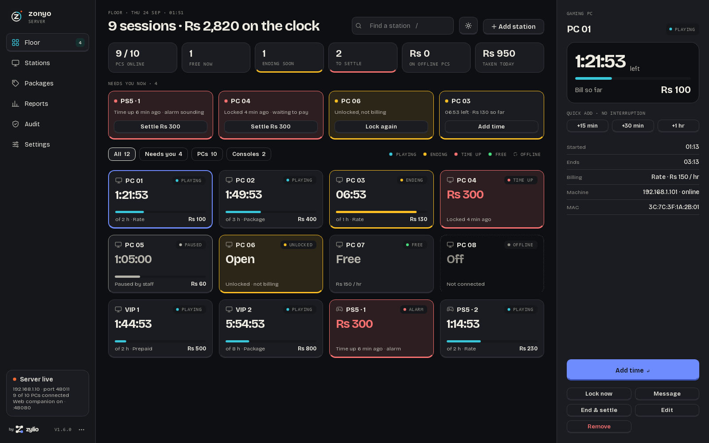
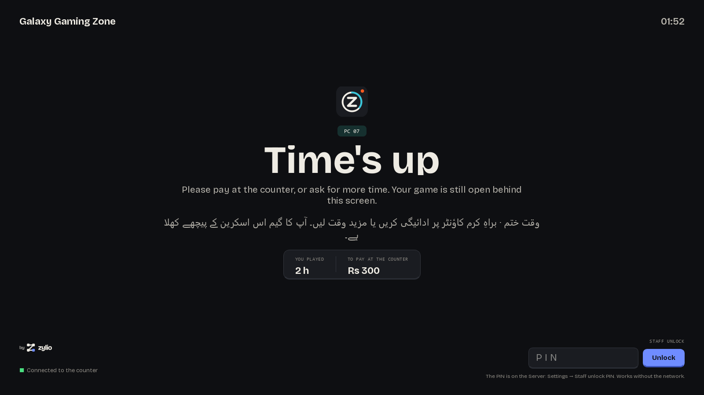
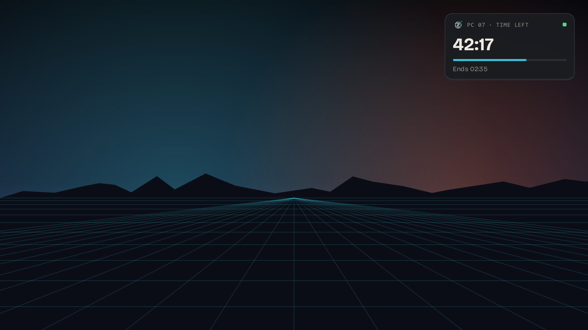
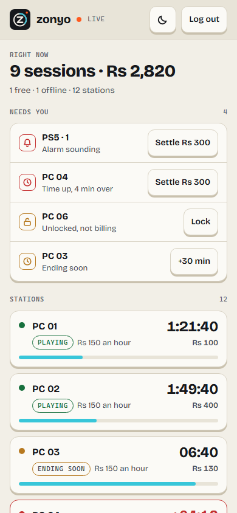

  

# zonyo — Gaming Zone & Cyber Café Management Software (Windows, LAN, Offline)

**zonyo** (formerly **ChronosGG**) is self-hosted **gaming zone management software** for
running a **cyber café**, **net café** or **esports lounge** on pay-per-time gaming PCs. Sell
time, lock PCs the moment it runs out, and know exactly what you earned — fully offline on
your own network. By **[zylio](https://zylio.net)**.

  <picture>
    <source media="(prefers-color-scheme: dark)" srcset="screenshots/server-floor-dark.png">
    
  </picture>

| App | Install it on… | What it does |
|-----|----------------|--------------|
| 🖥️ **zonyo Server** | Your **counter / reception PC** (one per café) | The operator dashboard: start and settle sessions, billing, packages, reports, and a web companion for your phone. |
| 🎮 **zonyo Client** | **Every gaming PC** you want to charge for | Shows the countdown, warns in English + Urdu, and locks the PC when paid time runs out. |

> **Rule of thumb:** the **Server** runs where *you* sit; a **Client** runs on every PC a
> *customer* plays on.

---

## Screenshots

| Floor | Start a session | Settle |
|---|---|---|
|  |  |  |
| **Reports** | **Stations** | **Dark mode** |
|  |  |  |

| Gaming PC: time's up | Gaming PC: countdown | Phone |
|---|---|---|
|  |  |  |

---

## Key features

- **Bill by the hour, packages or prepaid** — per-station prices, rounding once on the final
  bill, and consoles / VR / pool tables as manual stations with a time-up alarm.
- **Lock PCs automatically when time's up** — full screen on every monitor, with on-screen
  and spoken warnings at 10 and 5 minutes. Alt+Tab, Alt+F4 and the Windows key are blocked.
- **One screen to run the floor** — live numbers, a "Needs you now" queue, a tile per station
  and one big key for the next step. Settle with cash received and change.
- **English + Urdu on every gaming PC** — every customer message in two languages; the
  Server itself speaks 23 languages, right-to-left where needed.
- **Manage from your phone** — open the Server's address in any browser on the same Wi-Fi.
- **Reports** — today, yesterday, this month, this year; by day, mode and station; PDF or
  Excel. Audit log of every unlock, void and alarm.
- **Staff unlock PIN** that works even when the Server is down, with lockout after wrong
  tries.
- **Zero setup on gaming PCs** — the Client finds the Server by itself. Add PCs by network
  scan, IP or MAC from the Server.
- **Light and dark**, automatic updates, and gaming PCs update from the Server without
  internet.
- **Works fully offline** — no cloud, no account, no telemetry; your data stays on your PC.

---

## Download & install

Go to the **[Releases](../../releases)** page and download:

### 1. Counter / reception PC → **`zonyo-Server-Setup.exe`**
Installs the dashboard to Program Files with a Start Menu shortcut and an uninstaller, and
offers "start with Windows". The Floor's checklist walks you through the rest.

### 2. Every gaming PC → **`zonyo-Client-Setup.exe`**
**Nothing to enter** — the Client starts with Windows, **finds the Server on the LAN by
itself**, locks the PC and shows up on the dashboard ready to bill.

Both apps **update themselves automatically**. Upgrading from ChronosGG keeps your settings
and billing history.

---

## Quick start

1. Install and open the **Server** on your counter PC.
2. Install the **Client** on a gaming PC — it appears on the Server as a new PC.
3. Give it a number.
4. Start a session (by the hour, package or prepaid) — the PC unlocks and shows the countdown.
5. Set a web companion password under Settings, then open the address shown there from your
   phone on the same Wi-Fi.

---

## FAQ

**Which app do I install where?**
The **Server** on your one counter PC. A **Client** on every gaming PC you charge for.

**Does it need internet?**
No. zonyo runs entirely over your local network.

**What about consoles and pool tables?**
Add them as stations. They are timed and billed like PCs, and the Server sounds an alarm at
time up because nothing can lock them.

**Can I use it on my phone?**
Yes — the Server includes a web companion. Open it from any phone or tablet on the same Wi-Fi.

**Is my data private?**
Yes. Everything is stored on the Server PC; nothing is sent anywhere.

**What happened to ChronosGG?**
It is now called zonyo. Same software, new name and a new look; installed copies update in
place.

---

## Platforms

zonyo runs on **Windows** and **Linux** (x86_64), and they work together — a Linux Server runs
Windows Clients and vice versa.

| Download | Use it for |
|---|---|
| `zonyo-Server-Setup.exe` | Windows counter PC |
| `zonyo-Client-Setup.exe` | Windows gaming PC |
| `zonyo-Server-linux-x86_64.tar.gz` | Linux counter PC — extract, run `./zonyo-Server` |
| `zonyo-Client-linux-x86_64.tar.gz` | Linux gaming PC — extract, run `./zonyo-Client` |

> ⚠️ **The Linux Client is not a hardened kiosk.** Wayland forbids global keyboard grabs
> and nothing in userland can block `Ctrl+Alt+F<n>` console switching, so the lock appears
> but keyboard shortcuts are not blocked. **Run gaming PCs on Windows.** The Linux **Server**
> has no such limitation.

---

## Who is this for

Owners and operators of **gaming zones**, **cyber cafés**, **internet cafés**, **net cafés**,
**esports lounges** and **gaming lounges** who need a practical **PC timer** and
**pay-per-time** billing without an expensive commercial **café management system**. Built
for **gaming café Pakistan** operators first (PKR, English + Urdu), and works anywhere.

**Keywords:** zonyo, ChronosGG, gaming zone management software, cyber café management,
internet café software, net café software, esports lounge management, gaming lounge PC
management, LAN gaming center, pay-per-time billing, PC timer, prepaid billing, package
billing, cyber cafe billing software, PC lock software, café management system, gaming café
Pakistan, PKR billing, self-hosted software, offline software, no-cloud software.

---

Built by **[zylio](https://zylio.net)** — an independent software studio building fast,
honest tools for power users and gamers.

**Product page:** [zylio.net/software/zonyo](https://zylio.net/software/zonyo)

© 2026 zylio. All rights reserved.
